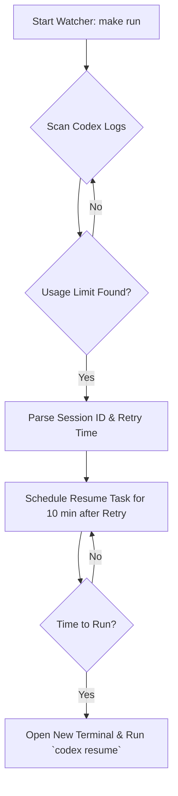

<div align="center">

**[ C :: A ]**

# Codex Auto-Resume

[**English**](./README.md) | [中文](./README.zh-CN.md)

[](https://github.com/your-repo/codex-auto-resume)
[](https://www.python.org/)
[](./LICENSE)
[](./CONTRIBUTING.md)

**Never let a usage limit interrupt your flow again. This tool automatically resumes your Codex sessions for you.**

</div>

---

## Table of Contents

- [About The Project](#about-the-project)
- [Features](#features)
- [How It Works](#how-it-works)
- [Scheduling Rules](#scheduling-rules)
- [Getting Started](#getting-started)
  - [Prerequisites](#prerequisites)
  - [Installation](#installation)
- [Usage](#usage)
  - [Common Commands](#common-commands)
  - [All Commands](#all-commands)
- [Contributing](#contributing)
- [License](#license)
- [Acknowledgements](#acknowledgements)

## About The Project

You're in the zone, deep in a coding session with Codex, and suddenly... **"You've hit your usage limit."**

Your focus is shattered. You have to remember to come back in an hour, find the right session, reopen the terminal, and try to piece together your train of thought.

**Codex Auto-Resume** solves this problem. It's a lightweight, fire-and-forget daemon that monitors your Codex activity. When it detects a usage limit error, it automatically schedules and triggers a new terminal session that resumes your work right where you left off, as soon as the lockout period is over.

It's designed to be a seamless, invisible assistant that keeps you productive.

## Features

- 🎯 **Automated Usage-Limit Detection**: Scans local Codex logs to detect usage-limit events and their retry timestamps.
- 🧠 **Intelligent Session Resolution**: Identifies the exact session and working directory affected by the usage limit.
- 💻 **Cross-Platform Terminal Integration**: Works with iTerm2, Terminal.app, gnome-terminal, and more.
- ⏰ **Scheduled & Debuggable Resumption**: Schedules resumes automatically and exposes scheduling/recovery debug flows when inspection is needed.
- 📊 **Token Usage Reporting**: Includes a script to summarize daily token usage and estimate costs.
- 🛡️ **Robust State Management**: Tracks processed errors and pending jobs to prevent duplicates.

## How It Works

The tool runs a small daemon in the background that follows a simple, robust workflow.



## Scheduling Rules

The watcher maintains `pending_jobs` with three rules:

1. Unexpired usage-limit events from different `session_id` values can coexist, but each session keeps only one active pending job: the latest and strongest candidate for that session.
2. Global secondary-window events outrank ordinary primary `retry at` events. In practice, both `secondary.used_percent == 100` and `credits exhausted while secondary active` are treated as `global_window` candidates.
3. Once a `global_window` candidate is detected, every not-yet-triggered session is rescheduled to run 10 minutes after that global retry time, because the primary window is no longer actionable once the secondary quota is exhausted.

## Getting Started

### Prerequisites

- Python 3.x
- `make` (optional, but recommended for easy command access)
- An existing Codex installation.

### Installation

1.  **Clone the repository**:
    ```bash
    git clone https://github.com/your-repo/codex-auto-resume.git
    cd codex-auto-resume
    ```

2.  **Make scripts executable**:
    ```bash
    make chmod
    ```

3.  **Start the watcher**:
    ```bash
    make run
    ```
    That's it! The watcher is now running in the background.

## Usage

### Common Commands

These are the commands you'll use most frequently.

| Command      | Description                                                                          |
|--------------|--------------------------------------------------------------------------------------|
| `make run`   | **(Recommended)** Starts the watcher in the background to continuously monitor for errors. |
| `make today` | Shows today's token summary, total tokens, active duration, session breakdown, and estimated costs. |
| `make usage` | Shows the same report as `make today`; pass `D=YYYY-MM-DD` to inspect a specific day.     |
| `make recent` | Shows token, cost, and active-duration stats for the latest `N` local days; pass `N=<days>` to override the default 30-day window. |
| `make debug` | Prints recent limit events and target scheduling state. You can also pass `DEBUG_ARGS` to inspect a specific debug flow. |
| `make status`| Displays the watcher's current state, including pending and completed jobs.            |
| `make test`  | Runs the automated test suite against sanitized fixtures derived from real-world samples. |

### All Commands

Here is a complete list of all available commands.

| Command         | Description                                                                       |
|-----------------|-----------------------------------------------------------------------------------|
| `make today`    | Show today's token summary, total tokens, active duration, session breakdown, and estimated costs. |
| `make usage`    | Show the same report as `make today`; pass `D=YYYY-MM-DD` for a specific day.     |
| `make recent`   | Show token, cost, and active-duration stats for the latest `N` local days (`N=30` by default). |
| `make run`      | Start the watcher daemon to continuously monitor for usage limit errors.          |
| `make status`   | Print the internal JSON state of the watcher (pending jobs, processed errors, etc.). |
| `make debug`    | Run the default debug view: recent 7-day limit events, confirmed candidates, and desired pending jobs. |
| `make test`     | Run the automated test suite with sanitized fixtures.                             |
| `make clean`    | Remove all temporary files, logs, and state generated by the watcher.             |
| `make chmod`    | Apply `+x` permissions to all shell scripts in the `scripts/` directory.          |

### Debug Variants

`make debug` accepts `DEBUG_ARGS` to reach focused debug subcommands:

- `make debug DEBUG_ARGS="--debug-limit-history --days 14"` shows recent limit history and scheduling decisions.
- `make debug DEBUG_ARGS="--debug-session <session_id>"` prints merged metadata and candidates for one session.
- `make debug DEBUG_ARGS="--debug-schedule-once"` runs one scheduling cycle without starting the daemon.
- `make debug DEBUG_ARGS="--debug-force-latest"` force-triggers the latest detected session for debugging.

### Usage Examples

- `make today` prints today's token totals, per-model summary, active duration, and session-level breakdown.
- `make usage D=2026-07-03` prints the same report for July 3, 2026.
- `make recent` prints token, cost, and active-duration statistics for the latest 30 local days.
- `make recent N=7` narrows that report to the latest 7 local days.
- Active duration is estimated from Codex turn lifecycles: each turn starts at `task_started`/`turn_context` and ends at `task_complete` or the last observed assistant/tool progress event. Pure user-input-only turns are not counted as Codex work time.


## Contributing

Contributions are what make the open source community such an amazing place to learn, inspire, and create. Any contributions you make are **greatly appreciated**.

Please see `CONTRIBUTING.md` for details on our code of conduct, and the process for submitting pull requests to us.

## License

Distributed under the MIT License. See `LICENSE` for more information.

## Acknowledgements

- [Shields.io](https://shields.io) for the awesome badges.
- Inspired by the need to stay focused during long coding sessions.
