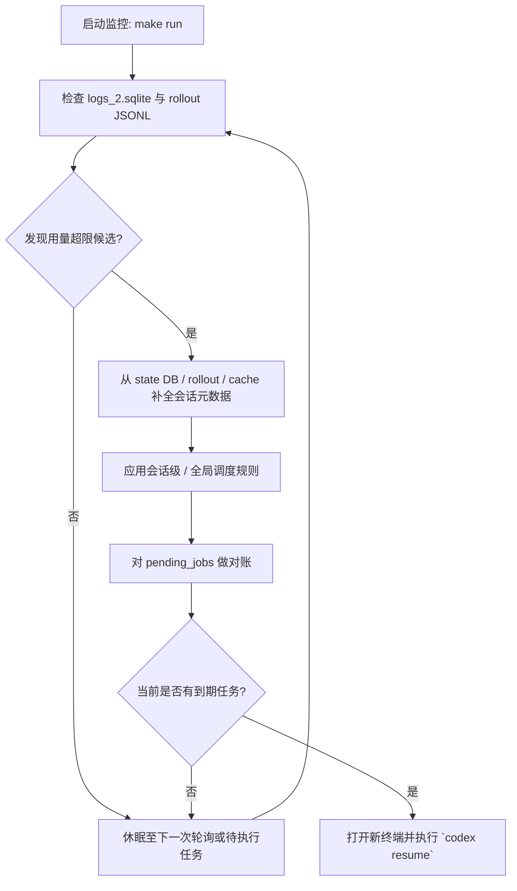

<div align="center">

**[ C :: A ]**

# Codex Auto-Resume

[English](./README.md) | [**中文**](./README.zh-CN.md)

[](https://github.com/your-repo/codex-auto-resume)
[](https://www.python.org/)
[](./LICENSE)
[](./CONTRIBUTING.md)

**不要让“用量超限”再次打断您的思路。本工具会自动为您恢复 Codex 会话。**

</div>

---

## 目录

- [关于本项目](#关于本项目)
- [功能特性](#功能特性)
- [工作原理](#工作原理)
- [调度规则](#调度规则)
- [开始使用](#开始使用)
  - [先决条件](#先决条件)
  - [安装步骤](#安装步骤)
- [使用方法](#使用方法)
  - [常用命令](#常用命令)
  - [所有命令](#所有命令)
  - [Debug 子命令](#debug-子命令)
  - [报表输出与高级参数](#报表输出与高级参数)
  - [使用示例](#使用示例)
- [贡献代码](#贡献代码)
- [许可证](#许可证)
- [致谢](#致谢)

## 关于本项目

您是否正在编程的“心流”状态中，与 Codex 深度协作，却突然看到……**“您已达到使用上限。”**

您的专注力瞬间被打破。您必须记着在一小时后回来，找到正确的会话，重新打开终端，然后努力拼凑回刚才的思路。

**Codex Auto-Resume** 正是为解决此问题而生。它会通过 `make run` 启动一个长期运行的 watcher/监控进程，持续监控您的 Codex 活动；当检测到用量超限错误时，它会在锁定时间结束后自动安排新的终端会话，让您从中断的地方无缝继续。

运行 watcher 时请保持当前终端开启；如果希望脱离当前 shell，请交给您自己的 supervisor 或进程管理器托管。

## 功能特性

- 🎯 **多来源用量超限检测**: 联合检查 `logs_2.sqlite`、rollout JSONL 文件以及 structured websocket `429` payload，识别用量超限候选和重试窗口。
- 🧠 **更稳健的会话定位**: 结合 state DB、rollout metadata 与缓存的线程信息定位会话；当 `thread_id` 缺失时，还能借助邻近的 `process_uuid` 上下文恢复。
- 💻 **跨平台终端集成**: 支持 iTerm2、Terminal.app、gnome-terminal 等多种终端应用。
- ⏰ **调度编排、对账与调试能力**: 支持会话级/全局窗口规则、全局二级窗口覆盖、`pending_jobs` 对账、过期清理，以及 dry-run 和 force-latest 调试流程。
- 📊 **面向 Session 的用量分析**: 提供日报、最近 `N` 天统计、成本估算、活跃时长、session 标题清洗、母子会话聚合与未归类子会话聚类。
- 🛡️ **数据库异常时的回退能力**: 当 `logs_2.sqlite` 或 `state_5.sqlite` 暂时不可用时，仍可借助 rollout 文件和缓存元数据继续运行，而不是直接失败。

## 工作原理

本工具运行的是一个长期运行的 watcher/监控进程，遵循一个简单而稳健的工作流。



当日志库短暂不可读时，watcher 仍会借助 rollout 文件与缓存的线程元数据继续对账和调度。

## 调度规则

监控器按照下面 4 条规则维护 `pending_jobs`:

1. 不同 `session_id` 的未过期用量超限事件会并存调度；同一个 `session_id` 只保留 1 条活跃任务，始终选择该会话当前最晚、最强的候选。
2. 二级总额度窗口事件优先于普通的一级 `retry at` 事件。实现上，`secondary.used_percent == 100` 以及 `credits exhausted while secondary active` 都会被视为 `global_window` 候选。
3. 一旦监听到 `global_window` 候选，所有尚未触发的会话恢复任务都会统一改到该候选的重试时间后 10 分钟执行，因为一级窗口在二级总额度耗尽后已不再有效。
4. 每轮扫描都会重新对账 `pending_jobs`，刷新元数据，替换更弱或更旧的任务，并把已不再生效的候选标记为过期。

## 开始使用

### 先决条件

- Python 3.x
- `make` (可选，但推荐使用以便于执行命令)
- 已安装的 Codex.

### 安装步骤

1.  **克隆仓库**:
    ```bash
    git clone https://github.com/your-repo/codex-auto-resume.git
    cd codex-auto-resume
    ```

2.  **赋予脚本执行权限**:
    ```bash
    make chmod
    ```

3.  **启动监控程序**:
    ```bash
    make run
    ```
    这会在当前 shell 中启动长期运行的 watcher；如果希望脱离当前终端，请交给您自己的进程管理方式。

## 使用方法

### 常用命令

这些是您最常用的命令。

| 命令         | 描述                                                       |
|--------------|------------------------------------------------------------|
| `make run`   | **(推荐)** 在当前 shell 中启动长期运行的 watcher 进程，持续监控用量超限错误。 |
| `make today` | 显示当天的 token 汇总、模型汇总、活跃时长、session/group 明细、未归类子会话聚类和预估成本；可通过 `F=<path>` 指定明细文件路径。 |
| `make usage` | 与 `make today` 相同；可通过 `D=YYYY-MM-DD` 指定查询日期，并通过 `F=<path>` 指定明细文件路径。 |
| `make recent` | 显示最近 `N` 天的 token、成本与活跃时长统计；默认 `N=30`，可通过 `N=<天数>` 覆盖，并通过 `F=<path>` 指定 Markdown 明细文件路径。 |
| `make debug` | 默认输出完整 debug dashboard；也可通过 `DEBUG_ARGS` 切换到聚焦的 debug 子流程。 |
| `make status`| 输出 watcher 的 JSON 状态，包括 `pending_jobs`、触发历史和最近一次检测到的元数据。 |
| `make test`  | 运行基于脱敏真实样本构建的自动化单测。                     |

### 所有命令

这是所有可用命令的完整列表。

| 命令             | 描述                                                           |
|------------------|----------------------------------------------------------------|
| `make today`     | 显示当天的 token 汇总、模型汇总、活跃时长、session/group 明细、未归类子会话聚类和预估成本；可通过 `F=<path>` 指定明细文件路径。 |
| `make usage`     | 与 `make today` 相同；可通过 `D=YYYY-MM-DD` 指定查询日期，并通过 `F=<path>` 指定明细文件路径。 |
| `make recent`    | 显示最近 `N` 天的 token、成本与活跃时长统计；默认 `N=30`，支持 `N=<天数>` 与 `F=<path>`，明细导出为 Markdown。 |
| `make run`       | 在当前 shell 中启动长期运行的 watcher 进程，以持续监控用量超限错误。 |
| `make status`    | 打印 watcher 的内部 JSON 状态，包括 `pending_jobs`、`triggered_jobs` 和最近一次检测到的元数据。 |
| `make debug`     | 默认输出包含 `Desired Pending Jobs`、`Confirmed Candidates`、`Rollout Limit Events`、`Recovered Structured 429 Events`、`Suspected Matches` 的 debug dashboard。 |
| `make test`      | 运行自动化单测与脱敏 fixtures。                                |
| `make clean`     | 删除监控程序生成的所有临时文件、日志和状态。                   |
| `make chmod`     | 为 `scripts/` 目录下的所有 shell 脚本赋予 `+x` 执行权限。      |

### Debug 子命令

默认 `make debug` 会输出 `Desired Pending Jobs`、`Confirmed Candidates`、`Rollout Limit Events`、`Recovered Structured 429 Events`、`Suspected Matches`。

`make debug` 支持通过 `DEBUG_ARGS` 进入具体 debug 子流程：

- `make debug DEBUG_ARGS="--debug-limit-history --days 14"` 查看近期 limit 历史与调度决策。
- `make debug DEBUG_ARGS="--debug-session <session_id>"` 查看单个会话的元数据与候选。
- `make debug DEBUG_ARGS="--debug-schedule-once"` 仅执行一轮调试调度，不启动常驻进程。
- `make debug DEBUG_ARGS="--debug-force-latest"` 对最近检测到的会话执行调试恢复。

### 报表输出与高级参数

- `make today` 与 `make usage` 的详细报表包含 overall summary、model summary、session detail，以及未归类子会话聚类。
- session 标题来自语义化用户请求，并会剔除 AGENTS 指令块、`[MODE: ...]`、JSON 状态噪音、shell command echo 行等非语义内容。
- 当 Codex 启动 `.24h-studio` 子 run 时，只要能从 run metadata 推断关系，报表就会把子 session 的用量归并回父 session；无法归母时，则按 `cwd` 聚类，并展示 average/median/P90/max 的 token 与 active duration 指标。
- active duration 来自 Codex turn 生命周期；重叠区间会合并，跨天区间会按本地日拆分，只有用户输入但没有观察到 Codex 实际工作的 turn 不计入工作时长。
- 所有 usage 命令都会打印明细文件路径；不传 `F=<path>` 时会自动写入临时文件。日报明细是纯文本，`recent` 明细是 Markdown。
- 直接调用 `scripts/codex_token_usage.py` 时，还支持 `-s/--summary-only`、`-z/--tz`，以及显式 `start_time end_time` 时间范围。

### 使用示例

- `make today` 输出当天的 token 汇总、模型汇总、活跃时长、session/group 明细和未归类子会话聚类。
- `make usage D=2026-07-03` 输出 2026-07-03 当天的同类报告。
- `make recent` 输出最近 30 天的 token、成本与活跃时长统计。
- `make recent N=7` 将上述统计窗口缩短为最近 7 天。
- `make today F=/tmp/codex-today.txt` 将当天详细报告写入固定的文本文件路径。
- `make recent N=7 F=/tmp/codex-recent-7d.md` 将最近 7 天的详细报告写入固定的 Markdown 文件路径。
- `python3 scripts/codex_token_usage.py "2026-07-01 00:00:00" "2026-07-01 23:59:59" -z America/Los_Angeles -f /tmp/codex-usage-la.txt` 按显式时间范围和时区生成 usage 报表。


## 贡献代码

开源社区因贡献而生生不息，我们衷心感谢您所做的任何贡献。

有关行为准则和提交拉取请求（Pull Request）的详细信息，请参阅 `CONTRIBUTING.md`。

## 许可证

本项目基于 MIT 许可证分发。详情请见 `LICENSE` 文件。

## 致谢

- [Shields.io](https://shields.io) 提供的精美徽章。
- 灵感来源于在长时间编码中保持专注的需求。
